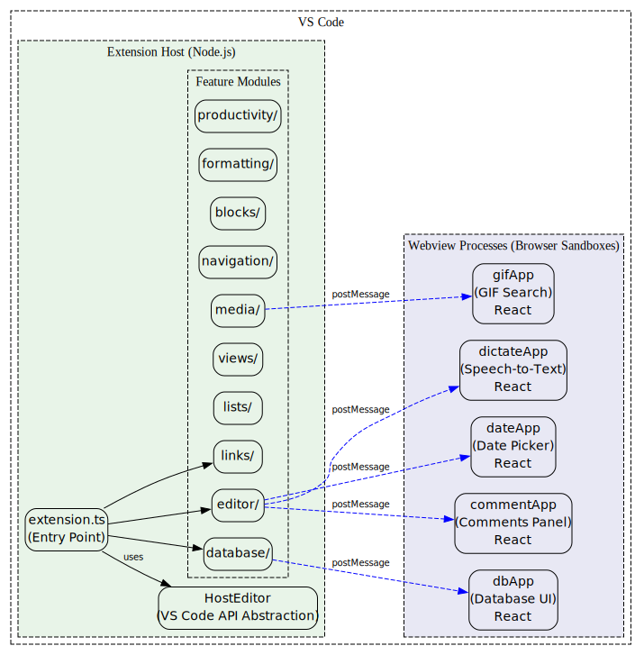
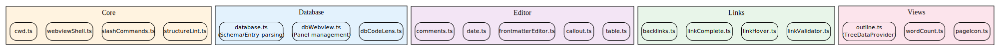
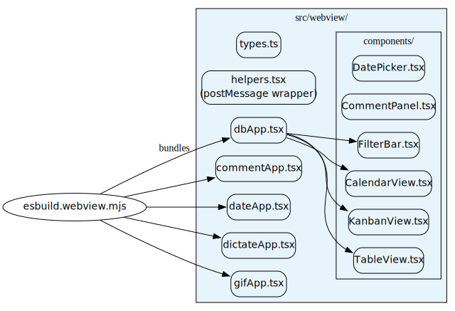
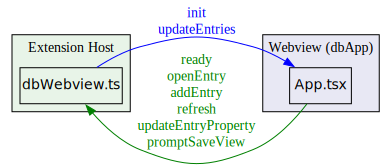
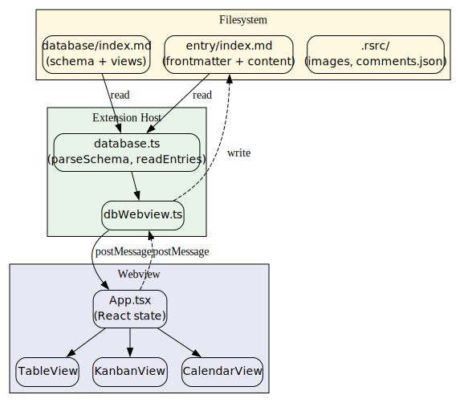

# Lotion Architecture

Lotion is a VS Code extension that brings Notion-like editing to Markdown. It uses a **two-process architecture**: the extension host (Node.js) and multiple webview sandboxes (browser).

---

## High-Level Architecture



<details>
<summary>View source</summary>

See [diagrams/architecture.dot](diagrams/architecture.dot)

</details>

---

## Process Isolation

| Process            | Runtime            | Role                                            |
| ------------------ | ------------------ | ----------------------------------------------- |
| **Extension Host** | Node.js            | Commands, file I/O, VS Code API, business logic |
| **Webviews**       | Browser (Chromium) | Rich UI with React, sandboxed from filesystem   |

Webviews cannot access the filesystem or VS Code API directly. All communication uses `postMessage`.

---

## Extension Host Modules



<details>
<summary>View source</summary>

See [diagrams/extension-modules.dot](diagrams/extension-modules.dot)

</details>

### Key Files

| File                    | Purpose                                                     |
| ----------------------- | ----------------------------------------------------------- |
| `HostEditor.ts`         | Abstraction layer re-exporting VS Code API symbols          |
| `extension.ts`          | Entry point; registers all commands, providers, listeners   |
| `core/webviewShell.ts`  | Shared HTML shell generator for all webviews                |
| `database/dbWebview.ts` | Opens/manages database webview panel, handles `postMessage` |
| `editor/comments.ts`    | Comment storage, panel management, CodeLens                 |
| `links/backlinks.ts`    | `TreeDataProvider` showing incoming links                   |

---

## Webview React Apps

Each webview is a **separate React application** bundled by esbuild:



<details>
<summary>View source</summary>

See [diagrams/webview-apps.dot](diagrams/webview-apps.dot)

</details>

### Build Process

```bash
# Build webviews
node esbuild.webview.mjs

# Watch mode
node esbuild.webview.mjs --watch
```

Output goes to `out/webview/<appName>.js` and `out/webview/<appName>.css`.

---

## postMessage Communication

Webviews communicate with the extension host via a strict message protocol.



<details>
<summary>View source</summary>

See [diagrams/postmessage.dot](diagrams/postmessage.dot)

</details>

### Example: Database Webview

**Extension → Webview:**

```typescript
panel.webview.postMessage({
  type: "init",
  schema: [...],
  entries: [...],
  views: [...],
  dbName: "Projects"
});
```

**Webview → Extension:**

```typescript
// helpers.tsx
const api = acquireVsCodeApi();
api.postMessage({ type: "openEntry", relativePath: "task-1/index.md" });
```

### Message Types

| Direction      | Message Type          | Purpose                     |
| -------------- | --------------------- | --------------------------- |
| Host → Webview | `init`                | Send schema, entries, views |
| Host → Webview | `updateEntries`       | Soft refresh entries only   |
| Webview → Host | `ready`               | Request initial data        |
| Webview → Host | `openEntry`           | Open a database entry file  |
| Webview → Host | `addEntry`            | Create new entry            |
| Webview → Host | `updateEntryProperty` | Inline edit frontmatter     |
| Webview → Host | `promptSaveView`      | Save current view state     |

---

## Data Flow



<details>
<summary>View source</summary>

See [diagrams/dataflow.dot](diagrams/dataflow.dot)

</details>

---

## Sidebar Views (TreeDataProviders)

Three tree views are registered in the Explorer sidebar:

| View ID            | Provider                 | Purpose                                 |
| ------------------ | ------------------------ | --------------------------------------- |
| `lotion.backlinks` | `BacklinksProvider`      | Shows files linking to current document |
| `lotion.outline`   | `HeadingOutlineProvider` | Document heading tree                   |
| `lotion.bookmarks` | `BookmarkTreeView`       | User-bookmarked pages                   |

These use VS Code's `TreeDataProvider` API, not webviews.

---

## Summary

1. **Extension Host** (Node.js): Handles commands, file I/O, VS Code integration
2. **Webviews** (Browser): Rich React UIs for database, comments, dates, GIFs, dictation
3. **Communication**: Strict `postMessage` protocol between processes
4. **HostEditor.ts**: Single abstraction point for VS Code API (enables future portability)
5. **Build**: esbuild bundles webview React apps to `out/webview/`
