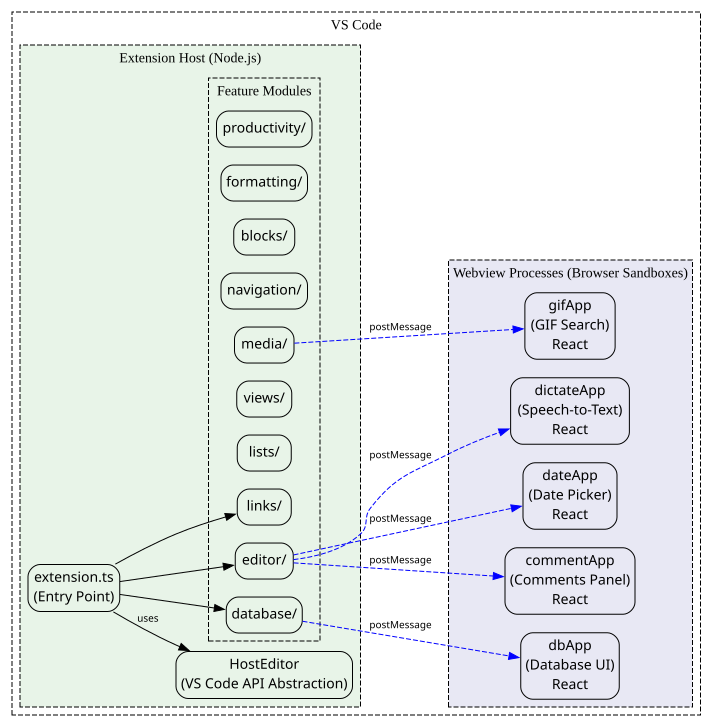
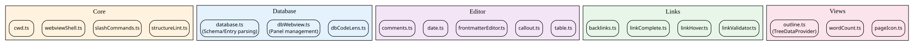
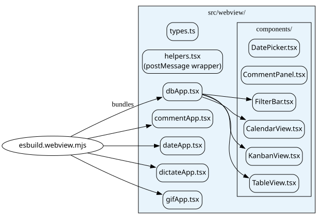
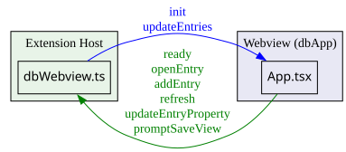
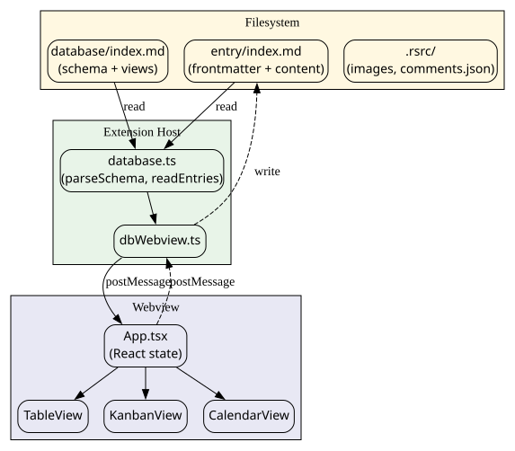

# Lotion Architecture

Lotion is a VS Code extension with a **two-process** shape: the
extension host (Node.js) and a small set of React webviews
(browser/Chromium). All work that touches files or the VS Code API
runs in the host; webviews handle rich UI only.

---

## High-level architecture



<details>
<summary>View source</summary>

See [diagrams/architecture.dot](diagrams/architecture.dot)

</details>

## Process isolation

| Process | Runtime | Role |
| --- | --- | --- |
| **Extension host** | Node.js | Commands, file I/O, VS Code API, business logic |
| **Webviews** | Chromium | Rich React UIs; sandboxed from filesystem and VS Code API |

Webviews cannot reach the filesystem or call VS Code APIs directly.
All communication is `postMessage` over a typed contract — see
[postMessage Communication](#postmessage-communication) below.

---

## Extension host modules



<details>
<summary>View source</summary>

See [diagrams/extension-modules.dot](diagrams/extension-modules.dot)

</details>

### Layout

```
src/
├── hostEditor/   ── VS Code API abstraction (HostingEditor.ts)
├── core/         ── command registry, slash commands, regex, blockIndex,
│                   filter system, webview shell, cursor context
├── editor/       ── slash handlers (callout, code, date, footnote, TOC),
│                   smart paste, tables, comments, processors
├── database/     ── lotion-db schema, entry creation, schema edits,
│                   DB webview host, table CSV/MD ↔ DB importers
├── formatting/   ── heading colours, smart typography, auto-inline-code,
│                   link factory, wrap toggles
├── links/        ── link completion, hover, validation, workspace search
├── navigation/   ── createPage/renamePage/movePage, recent pages, headings
├── media/        ── image drop/paste/hover, gif picker, graph (Graphviz)
├── views/        ── outline, page icons, reading progress, word count
├── productivity/ ── bookmarks, daily note, line lock, /commit, fireInto,
│                   task strikethrough
├── blocks/       ── block swap/duplicate/select, secretbox + crypto
├── lists/        ── continue, indent, renumber, checkbox toggle, marker colours
├── communicators/── extension-side typed channels to each webview
├── contracts/    ── message-shape types shared with the webviews
└── webview/      ── React apps (see below)
```

### Key files

| File | Purpose |
| --- | --- |
| `hostEditor/HostingEditor.ts` | Single point of contact for `vscode.*` APIs. No other extension-host file imports `vscode` directly. |
| `extension.ts` | Entry point — wires commands, providers, listeners, decorations |
| `core/slashCommands.ts` | Master `SLASH_COMMANDS` array (registry + completion provider) |
| `core/simpleCommands.ts` | `SIMPLE_COMMANDS` map + `slashHandler` wrapper so handlers work from palette or completion |
| `core/cmdFilter.ts` | `Filter().pageIsDbIndex().cursorInList()` fluent gating used by slash commands |
| `core/blockIndex.ts` | Per-document cached index of fences, callouts, details, tables |
| `core/webviewShell.ts` | Shared HTML shell + CSP for every webview |
| `database/dbWebview.ts` | Database webview lifecycle + `postMessage` routing |
| `editor/comments/commentPanel.ts` | Comments webview panel + slash command |
| `links/backlinks.ts` | `TreeDataProvider` for the *Backlinks* sidebar |

---

## Webview React apps

Each webview is a separate React app bundled by esbuild from
`src/webview/apps/<name>.tsx` to `out/webview/<name>.js` + `.css`.



<details>
<summary>View source</summary>

See [diagrams/webview-apps.dot](diagrams/webview-apps.dot)

</details>

| App | Host launcher | What it does |
| --- | --- | --- |
| `dbApp` | `database/dbWebview.ts` | Table/Kanban/Calendar/Graph/Map views of a DB |
| `dateApp` | `editor/date/datePanel.ts` | Calendar picker for `/date` |
| `commentApp` | `editor/comments/commentPanel.ts` | Threaded comments side panel |
| `gifApp` | `media/gif/` | Giphy/Klipy search picker |

### Build

```
node esbuild.webview.mjs            # build once
node esbuild.webview.mjs --watch    # rebuild on save
```

Output lands at `out/webview/<appName>.js` and `out/webview/<appName>.css`.

---

## postMessage communication

Each named webview has a **pair** of communicators, one per side,
backed by a typed message contract in `src/contracts/messages/`.



<details>
<summary>View source</summary>

See [diagrams/postmessage.dot](diagrams/postmessage.dot)

</details>

```
src/contracts/messages/<name>Messages.ts        ── shared shapes
src/communicators/<name>Communicator.ts         ── host side  (extension → webview)
src/webview/communicators/<Name>ToExtensionCommunicator.ts  ── webview side
```

Both communicators extend a `Communicator<MessageIn, MessageOut>`
base. Adding a new message means: edit the contract + add a
register/send method on each side.

### Example: database webview

**Host → webview** (initial load):

```typescript
communicator.sendInit({
  schema, entries, views, dbName, baseUri,
});
```

**Webview → host** (user opens an entry):

```typescript
communicator.sendOpenEntry(entry.relativePath);
```

| Direction | Message | Purpose |
| --- | --- | --- |
| Host → Webview | `init` | Schema, entries, views, db name |
| Host → Webview | `updateEntries` | Soft refresh of entries only |
| Webview → Host | `ready` | Webview booted, request `init` |
| Webview → Host | `openEntry` | Open an entry file in the editor |
| Webview → Host | `addEntry` | Create a new entry |
| Webview → Host | `updateEntryProperty` | Inline edit one cell |
| Webview → Host | `saveView` | Persist filter/sort state to the schema |
| Webview → Host | `copyToClipboard` | Host writes to OS clipboard |

---

## Data flow



<details>
<summary>View source</summary>

See [diagrams/dataflow.dot](diagrams/dataflow.dot)

</details>

---

## Sidebar tree views

Three explorer-pane tree views back the sidebar — these use
`TreeDataProvider`, **not** webviews:

| View ID | Provider | Purpose |
| --- | --- | --- |
| `lotion.backlinks` | `BacklinksProvider` | Files linking to the current document |
| `lotion.outline` | `HeadingOutlineProvider` | Heading tree of the current document |
| `lotion.bookmarks` | `BookmarkTreeView` | User-bookmarked pages |

---

## CodeLens generators

`core/codelensGenerators.ts` registers stateless lens generators per
file type. The current set:

- Database index → "↻ Open as table", "+ New entry"
- Graph block → "▶ Render graph"
- Date string → "Update date" (opens the calendar webview)
- Processor block → "▶ Re-run"
- Comment marker → resolve / delete

Plus a stateful generator in `links/` for backlink counts.

---

## Decorations

Tinting / colouring is layered on the editor via
`TextEditorDecorationType`:

- `formatting/headingColors.ts` — H1–H6 line colours
- `lists/listMarkerColors.ts` — list markers tinted by indent depth
- `editor/editorDecorations.ts` — callout backgrounds, `==highlight==`,
  fenced-code-block tint
- `productivity/taskStrikethrough.ts` — strike-through on `- [x]`

---

## Tests

| Suite | Where | Runner | Run with |
| --- | --- | --- | --- |
| Pure-helper unit tests | `src/__tests__/` | Jest (vscode mocked) | `npm test` |
| End-to-end integration | `src/test/` | `@vscode/test-cli` (real VS Code) | `npm run test:int` |

The integration suite uses `xvfb-run` automatically when present so it
runs headless on Linux. Workspace fixture infra lives in
`src/test/_helpers.ts` (`createFixture`, `removeFixture`,
`stubInputBox`, etc.); the test workspace is rooted at
`src/test/fixtures/`.

---

## Summary

1. **Extension host** (Node.js) owns files, commands, VS Code API.
2. **Webviews** (Chromium) own rich UI — DB, dates, comments, GIFs.
3. **Communication** is typed `postMessage`, host-side and
   webview-side communicators paired via a shared contract.
4. **HostingEditor.ts** is the single VS Code-API choke point — every
   other extension-host module routes through it.
5. **Build** — `tsc` for extension host, `esbuild` for webviews.
