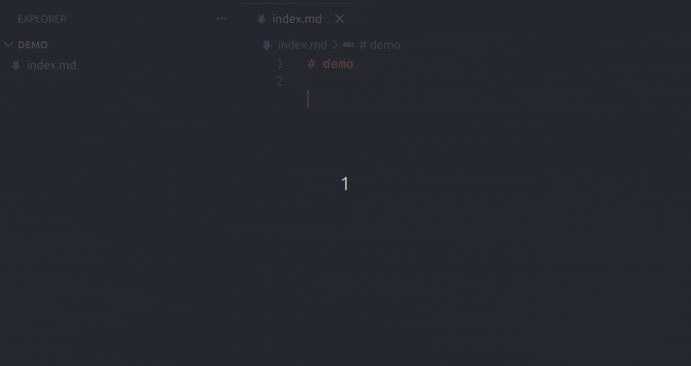
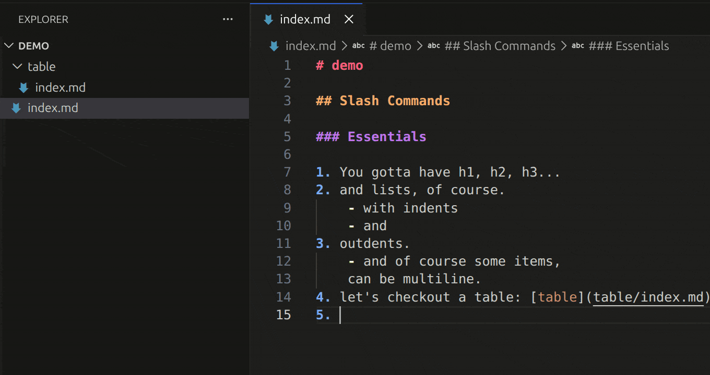

# Lotion

**Notion-like editing for Markdown** — slash commands, databases, backlinks, smart paste.

Lotion turns VS Code into a structured-writing environment, but every file
stays plain Markdown on disk — git-friendly, portable, no proprietary
format.

| Slash commands                                                    | Databases                                                         |
| ----------------------------------------------------------------- | ----------------------------------------------------------------- |
|  |  |

---

## Slash commands

Type `/` on any line to browse. The table below is auto-generated from
the source (`npm run docs:slash-table`) — see `src/core/slashCommands.ts`
for the canonical list.

<!-- BEGIN AUTO-SLASH-TABLE -->

| Command             | Description                                         |
| ------------------- | --------------------------------------------------- |
| `/align`            | ↔️ Re-align table columns                           |
| `/callout`          | 📢 Callout block (NOTE, TIP, WARNING...)            |
| `/carousel`         | 🎠 Insert an image carousel from .rsrc              |
| `/clean-list`       | 🧹 Remove empty lines/items in current list         |
| `/code`             | 🔣 Fenced code block                                |
| `/cols-left`        | ⬅️ Add columns to the left                          |
| `/cols-right`       | ➡️ Add columns to the right                         |
| `/comments`         | 💬 Show/manage comments on this page                |
| `/commit`           | 📦 Git: stage all, commit & push                    |
| `/copy`             | 📋 Copy code (inline span or block)                 |
| `/copy-column`      | 📋 Copy current column                              |
| `/csv-to-db`        | 🧾 Create a new DB from CSV file                    |
| `/cut-column`       | ✂️ Cut current column                               |
| `/database`         | 🗄️ Create a database (typed table)                  |
| `/date`             | 🗓️ Insert a specific date                           |
| `/delete-col`       | 🗑️ Delete current column                            |
| `/delete-field`     | 🗑️ Remove a field from the schema                   |
| `/delete-row`       | 🗑️ Delete current row                               |
| `/divider`          | ➖ Horizontal divider — ---                         |
| `/emoji`            | 😀 Insert an emoji                                  |
| `/export`           | 📄 Export page to PDF / HTML                        |
| `/footnote`         | 📝 Insert a numbered footnote                       |
| `/frontmatter`      | 📋 YAML front matter block                          |
| `/gif`              | 🎬 Search for a GIF                                 |
| `/graph`            | 📈 Insert a Graphviz diagram                        |
| `/h1`               | 𝗛 Heading 1 — #                                     |
| `/h2`               | 𝗛 Heading 2 — ##                                    |
| `/h3`               | 𝗛 Heading 3 — ###                                   |
| `/image`            | 🖼️ Insert an image                                  |
| `/inline-math`      | 🧮 Inline math — $ ... $                            |
| `/link`             | 🔗 Insert link to a page                            |
| `/lock`             | 🔒 Encrypt a secret box with a password             |
| `/math`             | 🧮 LaTeX math block — $$ ... $$                     |
| `/mermaid`          | 🧭 Mermaid diagram block                            |
| `/move-page`        | 📦 Move current page folder                         |
| `/new-entry`        | ➕ Add a new database entry                         |
| `/new-field`        | ➕ Add a new field to the schema                    |
| `/new-view`         | 👁️ Create a saved view with sort & filter           |
| `/openlink`         | 📂 Open the nearest page link                       |
| `/page`             | 📄 Create a child page                              |
| `/paste-column`     | 📥 Paste column from clipboard                      |
| `/processor`        | 🔧 Insert a processor block (shell command)         |
| `/quote`            | 💬 Blockquote — >                                   |
| `/refresh`          | 🔄 Re-run all processor blocks in this file         |
| `/rename-field`     | ✏️ Rename a schema field across entries             |
| `/rename-page`      | ✏️ Rename current page folder and update links      |
| `/render`           | ▶ Re-render graph from DOT source                   |
| `/renumber`         | 🔢 Renumber the entire ordered list                 |
| `/resource`         | 📎 Attach a file from disk into .rsrc               |
| `/rows-above`       | ⬆️ Add rows above                                   |
| `/rows-below`       | ⬇️ Add rows below                                   |
| `/secretbox`        | 🔐 Secret box — lockable <details> block            |
| `/section`          | 📑 Divider + section heading scaffold               |
| `/sort`             | 🔤 Sort table by column                             |
| `/sync-field-order` | 🔁 Sync entry field order to schema                 |
| `/table`            | 📊 Insert a table                                   |
| `/table-to-db`      | 📊 Create a new DB from markdown table under cursor |
| `/th1`              | ▶ Toggle heading 1 (collapsible)                    |
| `/th2`              | ▶ Toggle heading 2 (collapsible)                    |
| `/th3`              | ▶ Toggle heading 3 (collapsible)                    |
| `/to-bullets`       | • Convert numbered list to bullet list              |
| `/to-numbered`      | 🔢 Convert bullet list to numbered list             |
| `/toc`              | 📑 Table of contents from headings                  |
| `/today`            | 📅 Insert today's date                              |
| `/todo`             | ☑️ To-do checkbox — - [ ]                           |
| `/toggle`           | ▶ Collapsible toggle block                          |
| `/transpose`        | 🔄 Transpose table rows/cols                        |
| `/turninto`         | 🔄 Turn heading/link into something else            |
| `/unlock`           | 🔓 Decrypt a locked secret box                      |
| `/update-processor` | ✏️ Change a processor's shell command               |
| `/view-database`    | 📊 Open database webview                            |

<!-- END AUTO-SLASH-TABLE -->

A few of these (`/database`, `/view-database`, `/move-page`) work only in
the right context — e.g. inside a database index, or on an `index.md`
page. Use the slash-command filter to discover what's available where
you are.

## Databases

A database is a folder with:

- `index.md` carrying a ` ```lotion-db ` schema fence (columns +
  saved views),
- one `<slug>/index.md` per entry, with properties in a markdown
  property table.

`/view-database` opens an interactive webview with **table**,
**kanban**, **calendar**, **graph**, and **map** layouts. Sort by
clicking a column's dedicated sort button (⇅ / ▲ / ▼); filter via the
filter bar. New entries from the webview create the entry file and
link it back into the index automatically.

## Links

- **Wiki links** — type `[[` for a workspace-wide page picker; accept
  to insert a regular markdown link.
- **Backlinks** — the _Backlinks_ sidebar lists every page that links
  to the current one, refreshed live.
- **Link validator** — broken links are flagged as diagnostics.
- **Link conversion** — `lotion.linksToReference` and
  `lotion.linksToInline` round-trip between inline `[text](url)` and
  reference `[text][1]` … `[1]: url` styles.
- **Link factory rules** — configure regex → URL templates in
  `lotion.linkFactoryRules` to auto-wrap typed patterns (e.g. issue
  numbers → JIRA URLs).

## Smart paste

`Ctrl+V` in markdown is rerouted through smart paste:

- Plain URL on the clipboard, with text selected → wraps as
  `<a href="…">selected text</a>` (no network call needed).
- Plain URL on the clipboard, no selection → fetches the page title,
  inserts `<a href="…">Title</a>`.
- Image URL → ``.
- Tab- or comma-separated text → markdown table.
- Image on the clipboard → saved to `.rsrc/` and inserted as ``.
  Uses VS Code's native `registerDocumentPasteEditProvider` on 1.97+
  (no powershell/wslpath/xclip dance).
- In a code context, falls back to plain paste.

## Comments

`Lotion: Add Comment` (or `/comments` for the panel) attaches a review
comment to the selected text. Storage is `.rsrc/comments.json` next
to the doc; an HTML marker (`<!--lotion-comment:ID-->`) anchors the
comment to its line. CodeLens above the comment shows author and a
resolve / delete action.

## Secret boxes

`/secretbox` inserts a `<details>` block marked with
`<!--lotion-secretbox-->`. `/lock` encrypts the body with a password
(PBKDF2 + AES-GCM); `/unlock` decrypts. A save guard prevents writing
an unlocked secret box to disk so plaintext never gets committed.

## Daily notes

`Lotion: Open Daily Note` opens (creating if needed) today's note at
`<lotion.dailyNotePath>/YYYY-MM-DD.md`. Date format is configurable.

## Graphs

`/graph` inserts a Graphviz DOT block rendered to SVG. `/render`
re-renders the SVG from the current DOT source. SVGs are written to
the page's `.rsrc/`.

## Typography & code helpers

- **Smart typography** — auto-replace straight quotes/dashes/ellipses
  with typographic equivalents (toggle via `lotion.smartTypography`).
- **Ligatures** — replace `->`, `<-`, `<->` with unicode/emoji arrows
  (`lotion.ligatureStyle`).
- **Auto inline code** — wrap identifier-cased words in backticks when
  configured (`lotion.autoInlineCodeCases`).
- **Auto-renumber lists** — fix ordered-list numbering on save
  (`lotion.autoRenumberLists`).
- **Trailing newline** — enforce exactly one EOF newline on save
  (`lotion.trailingNewline`).

## Structure linter

Diagnostics for skipped heading levels, multiple H1s, duplicate
heading text (ambiguous anchors), empty links, very long lines, and
unclosed code fences.

## Decorations

- Heading colours by level (H1–H6).
- List marker colours by indent depth — bypasses VS Code's grammar
  losing track of lazy continuation lines.
- Callout background tint + gutter accent for `> [!NOTE]` style blocks.
- `==highlight==` background tint.
- Code-fence whole-line tint.
- Strike-through on completed `- [x]` tasks.

## Other

- **Bookmarks** — `Lotion: Bookmark Page` adds the active page to the
  _Bookmarks_ sidebar.
- **Page icons** — `lotion.setPageIcon` stores an emoji in frontmatter
  (shown in the breadcrumb and outline).
- **Quick switcher** — `Alt+P` for fuzzy page open.
- **Recent pages** — `Alt+R` for an MRU list.
- **Git commit** — `/commit` stages and commits the workspace, with
  an optional push (`lotion.git.neverPush` to skip).
- **Fire into** — `lotion.fireInto` pastes clipboard into a chosen
  page without opening it.

---

## Keyboard shortcuts

| Shortcut          | Mac               | Action                                |
| ----------------- | ----------------- | ------------------------------------- |
| `Ctrl+V`          | `Cmd+V`           | Smart paste                           |
| `Ctrl+B`          | `Cmd+B`           | Toggle **bold** (on selection)        |
| `Ctrl+I`          | `Cmd+I`           | Toggle _italic_ (on selection)        |
| `Alt+S`           | `Alt+S`           | Toggle ~~strikethrough~~              |
| `` Alt+` ``       | `` Alt+` ``       | Toggle `inline code`                  |
| `Alt+H`           | `Alt+H`           | Toggle ==highlight==                  |
| `Alt+Shift+Left`  | `Alt+Shift+Left`  | Promote heading (`##` → `#`)          |
| `Alt+Shift+Right` | `Alt+Shift+Right` | Demote heading                        |
| `Enter`           | `Enter`           | Continue list / blockquote / checkbox |
| `Tab`             | `Tab`             | Indent list item                      |
| `Shift+Tab`       | `Shift+Tab`       | Outdent list item                     |
| `Alt+D`           | `Alt+D`           | Toggle checkbox `[ ]` ↔ `[x]`         |
| `Alt+J`           | `Alt+J`           | Jump to next heading                  |
| `Alt+K`           | `Alt+K`           | Jump to previous heading              |
| `Ctrl+Shift+H`    | `Cmd+Shift+H`     | Jump to heading (picker)              |
| `Alt+P`           | `Alt+P`           | Quick-switch page                     |
| `Alt+R`           | `Alt+R`           | Recent pages                          |
| `Alt+L`           | `Alt+L`           | Search workspace links                |
| `Ctrl+Alt+C`      | `Ctrl+Alt+C`      | Search workspace commands             |
| `Ctrl+Shift+B`    | `Cmd+Shift+B`     | Select current block                  |
| `Ctrl+Shift+D`    | `Cmd+Shift+D`     | Duplicate block                       |
| `Alt+Shift+Up`    | `Alt+Shift+Up`    | Swap block up                         |
| `Alt+Shift+Down`  | `Alt+Shift+Down`  | Swap block down                       |
| `Alt+Left/Right`  | `Alt+Left/Right`  | Move cell ←/→ inside a table          |
| `Alt+Up/Down`     | `Alt+Up/Down`     | Move row ↑/↓ inside a table           |
| `Alt+Home/End`    | `Alt+Home/End`    | Jump to start/end of table row        |
| `Alt+PgUp/PgDn`   | `Alt+PgUp/PgDn`   | Jump to start/end of table column     |
| `Ctrl+Alt+F`      | `Ctrl+Alt+F`      | Fire clipboard into another page      |

---

## Sidebar views

| View                 | Description                        |
| -------------------- | ---------------------------------- |
| **Document Outline** | Heading tree for the current file  |
| **Backlinks**        | Pages that link to the current one |
| **Bookmarks**        | Bookmarked pages                   |

## Status bar

| Indicator        | Description                                            |
| ---------------- | ------------------------------------------------------ |
| Word count       | Live document/selection word count + reading time      |
| Reading progress | Scroll progress percentage                             |
| Line lock        | Click-toggle to keep the cursor at a fixed screen line |

---

## Settings

| Setting                               | Default        | Description                                                |
| ------------------------------------- | -------------- | ---------------------------------------------------------- |
| `lotion.dailyNotePath`                | `"journal"`    | Folder for daily notes (relative to workspace root)        |
| `lotion.imageDir`                     | `".rsrc"`      | Folder for images alongside each page                      |
| `lotion.readingSpeed`                 | `230`          | Words per minute for reading-time estimate                 |
| `lotion.dateFormat`                   | `"YYYY-MM-DD"` | Default format for daily notes and date insertion          |
| `lotion.smartTypography`              | `false`        | Auto-replace straight quotes/dashes/ellipses               |
| `lotion.ligatureStyle`                | `"unicode"`    | Replace `->`, `<-`, `<->` with unicode/emoji arrows        |
| `lotion.autoRenumberLists`            | `true`         | Renumber ordered lists on save                             |
| `lotion.trailingNewline`              | `true`         | Ensure one trailing newline on save                        |
| `lotion.autoInlineCodeCases`          | `{}`           | Auto-wrap PascalCase / camelCase / snake_case in backticks |
| `lotion.linkFactoryRules`             | `[]`           | Regex → URL rules for auto-linking typed patterns          |
| `lotion.smartPasteLinkLabelMaxLength` | `30`           | Truncate auto-link labels longer than this                 |
| `lotion.smartPaste.debug`             | `false`        | Log smart-paste decisions to the dev console               |
| `lotion.gifProvider`                  | `""`           | `giphy` or `klipy`                                         |
| `lotion.giphyApiKey`                  | `""`           | Giphy API key for `/gif` search                            |
| `lotion.klipyApiKey`                  | `""`           | Klipy API key for `/gif` search                            |
| `lotion.git.neverPush`                | `false`        | Skip push after `/commit`                                  |
| `lotion.git.remoteUrl`                | `""`           | Git remote URL to add when none configured                 |
| `lotion.commentUsername`              | `""`           | Your name on comments (set on first use)                   |

---

## Requirements

- VS Code 1.80 or later
- Markdown files (`.md`)

## Development

```
npm install
npm run compile          # tsc + esbuild for webviews
npm test                 # Jest unit tests for pure helpers
npm run test:int         # @vscode/test-cli integration tests in real VS Code
npx vsce package         # build .vsix
```

See [ARCHITECTURE.md](ARCHITECTURE.md) for the module map.

## License

[GPL-3.0](LICENSE.md)
